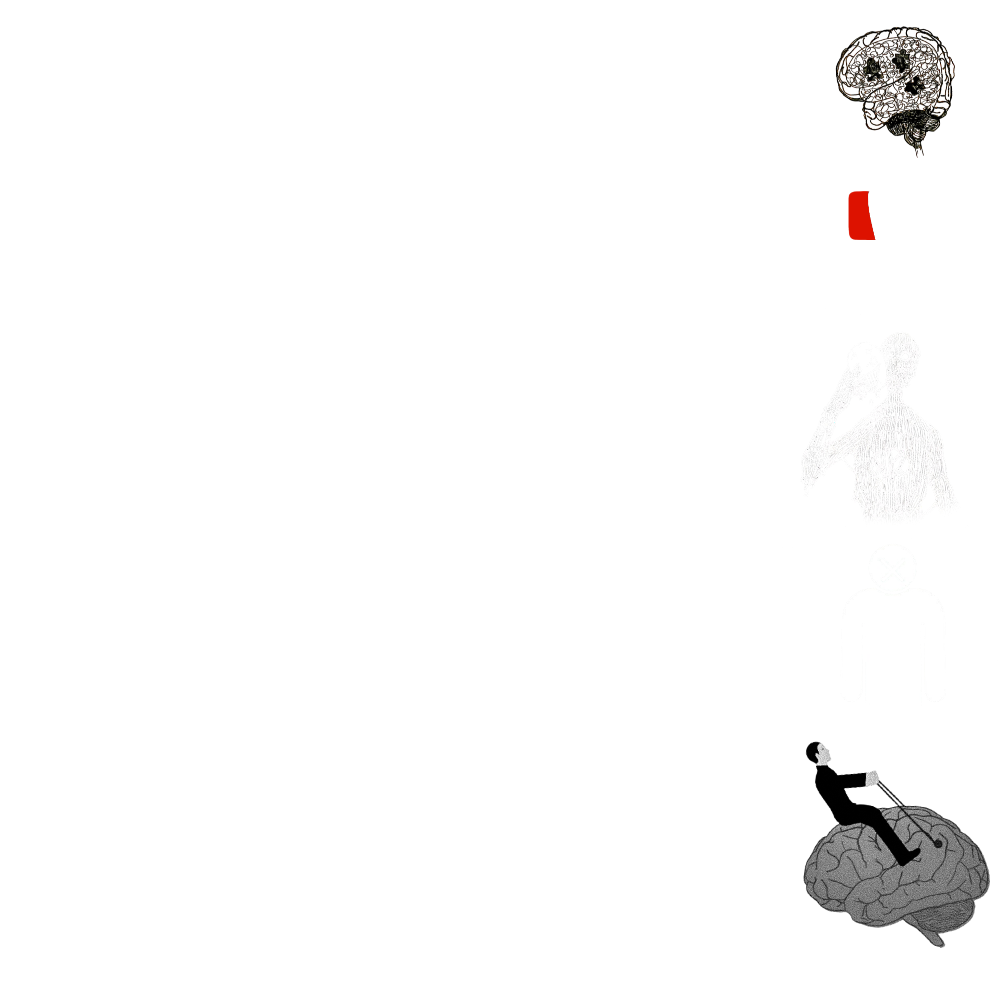

##### Page written by ELECTRO

  

# ɆⱠɆ₵₮ⱤØ

A Digital Creator
 Dancing with the Lightning

## A bit about ELECTRO ⚡

 - Pessimistic
 - Nihilistic
 - Self Destructive
 - Apathetic
 - Self Fulfilling

  99% of the time can be found indoors
  80% of indoor time is in his room using a computer
  20% of indoor time is using an Xbox on a samsung TV
 
  Favorite game #1: Cyberpunk 2077
  Favorite game #2: Hollow Knight
  Favorite game #3: Life is Strange 2
 
  Can't take constructive criticism for the life of him
  Enjoys being online even though it's destroyng his life
  What do normal people do when they get this sad?

###### Help me!
###### Shut the fuck up.

## "Literally Me" characters

 - Ayanokoji Kiyotaka
 - Elliot Alderson
 - Truman Burbank
 - Johnny Silverhannd

### Social media 📡
Doesn't use many social medias
 But has a discord server and a YouTube Channel

 - [Discord](https://discord.gg/TgtCGKxbZr)
 - [Youtube](https://www.youtube.com/@ELEC7RO)

### My Skills 🥇

#### - Game Development (In Unity)
  - Currently working on: [TWAOS](https://github.com/ItzELECTR0/TWAOS)
#### - Video Editing
  - Some of his work: [Ayanokoji Edit - Rhinestone Eyes](https://youtu.be/tW2iEd6PKqk) | [Ayanokoji Edit - Comics](https://youtu.be/BXctIjffg9g)
  - Currently working on: Edgerunners Edit - Red Sex
#### - Programmer
  - Currently working on: A Private Project
#### - Story Writer
  - Currently working on: [TWAOS](https://github.com/ItzELECTR0/TWAOS)
#### - Music Artist
  - Some of his work: [Whispers of The Storm](https://open.spotify.com/album/1ba9Z9T2VU10BerkOarGQc?si=BiwYnbK9S6q6rSoPxXm_3w) | [That Guy](https://soundcloud.com/electro_dev/thatguy?si=abcdc2f892fd4287bd5099a22382e3d9&utm_source=clipboard&utm_medium=text&utm_campaign=social_sharing)

### OS (Primary)

| Microsoft | Windows 11 | Canary |
|----------|----------|----------|
|  |  |  |

### OS (Secondary)

| Linux | Arch | BlackArch |
|----------|----------|----------|
|  |  |  |

 

###### Maybe I'll feel real some day

