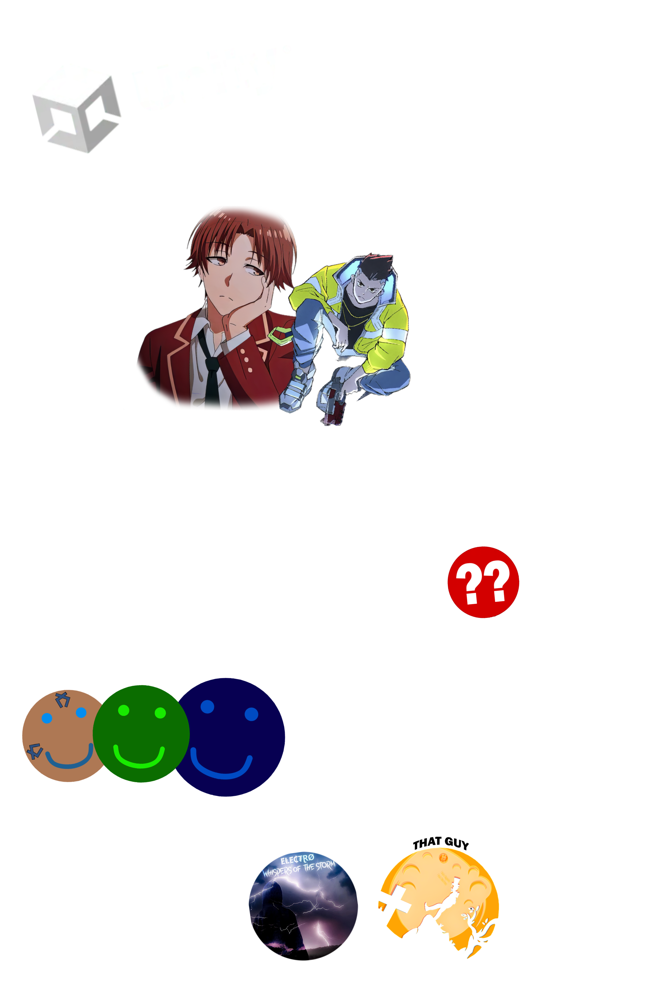
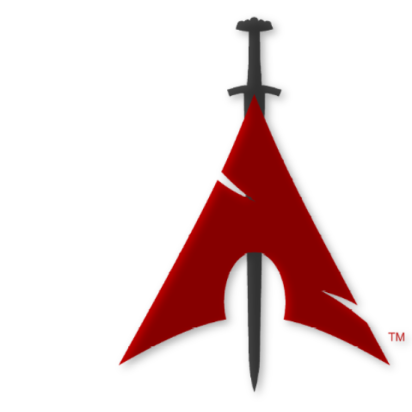

 <h6>Intended for Dark Mode &emsp;&emsp;&emsp;&emsp;&ensp;&emsp;&emsp;&emsp;&emsp;&ensp;&emsp;&emsp;&emsp;&emsp;&emsp;&emsp;&emsp;&emsp;&emsp;&emsp;&emsp;&emsp;&emsp;&emsp;&emsp;&emsp;&emsp;&emsp;&emsp;&emsp;&emsp;&emsp;&emsp;&emsp;Page written by ELECTRO</h6>

  

# ɆⱠɆ₵₮ⱤØ

A Digital Creator
 Dancing with the Lightning

## A bit about ELECTRO ⚡

 - Creative
 - Pessimistic
 - Nihilistic
 - Self-Destructive
 - Em|pathetic

  Favorite game #1: [Steins;Gate](https://store.steampowered.com/app/412830/STEINSGATE/)
  Favorite game #2: [Hollow Knight](https://store.steampowered.com/app/367520/Hollow_Knight/)
  Favorite game #3: [Cyberpunk 2077](https://store.steampowered.com/app/1091500/Cyberpunk_2077/)
 
  Favourite song #1: [Rhinestone Eyes](https://open.spotify.com/track/1foMv2HQwfQ2vntFf9HFeG?si=ad2bca755a3c42c5)
  Favourite song #2: [Count Me Out](https://open.spotify.com/track/6BU1RZexmvJcBjgagVVt3M?si=f8f8a315d273498d)
  Favourite song #3: [Mr. Rager](https://open.spotify.com/track/393MDhe62s8hbH8ETrlxe5?si=1a3a375ffba54013)
 
  Favourite light novel #1: [Classroom of The Elite](https://www.amazon.com/dp/B0B5S63MC4?binding=paperback)
  Favourite light novel #2: [86 EIGHTY-SIX](https://www.amazon.com/dp/B081QB9H2V?binding=paperback&searchxofy=true)
  Favourite light novel #3: [Re:ZERO](https://www.amazon.com/dp/B084YX78DJ?binding=paperback)

###### When you deserve it All   It All just always seems to Linger

## "Literally Me" characters ❤️‍🔥

 - Ayanokoji Kiyotaka
 - Elliot Alderson
 - Truman Burbank
 - Johnny Silverhannd

### Social media 📡
You can check out my website
 - [ELECTRIS.net](https://electris.net)

Or my Discord

 - [discord.ELECTRIS.net](https://discord.electris.net)

### Skills & Works 🥇

#### - Game Development (In Unity)
  - Currently working on: [TWAOS](https://github.com/ItzELECTR0/TWAOS)
#### - Web Development (In Claude)
  - Currently working on: [electris.net](https://github.com/ItzELECTR0/electris.net)
#### - Video Editing (In Wondershare Filmora)
  - Some of his work: [DUCKW/LAZĂR](https://youtu.be/2FNziah2QtA) | [Ayanokoji Edit - Comics](https://youtu.be/BXctIjffg9g)
  - Currently working on: Eighty-Six Edit - Alien Blues
#### - Programming
  - Currently working on: Nothing really, just learning.
#### - Story Writing (In Obsidian.md)
  - Currently working on: [TWAOS](https://github.com/ItzELECTR0/TWAOS)
#### - Music Artist (In Adobe Audition)
  - Some of his work: [Whispers of The Storm](https://open.spotify.com/album/1ba9Z9T2VU10BerkOarGQc?si=BiwYnbK9S6q6rSoPxXm_3w) | [That Guy](https://soundcloud.com/electro_dev/thatguy?si=abcdc2f892fd4287bd5099a22382e3d9&utm_source=clipboard&utm_medium=text&utm_campaign=social_sharing)
  - Currently working on: Gratitude & Electric Ego | Heart of Nothing

### OS (Primary) 🐐

| Linux | Arch | BlackArch |
|----------|----------|----------|
|  |  |  |

### OS (Secondary) 🌐

| Microsoft | Windows 11 | Canary |
|----------|----------|----------|
|  |  |  |

 

###### Heavy is the head that chose to wear the crown

